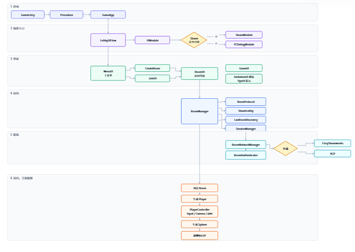

# Spherical Room
Unity 6 多人联机

Unity 6 四人派对。玩家在房间里推动共享球。开房的那台机器是主机，位置和物理只在主机上计算。

## 运行
1. 使用 Unity `6000.3.14f1` 打开 `UnityProject`。
2. 打开 `Assets/AssetRaw/Scenes/Launcher.unity`，从该场景进入 Play。`Room` 由开局后加载，不要把它当启动场景。
3. 一个人创建房间并开始游戏，另一个人从列表加入。
4. Steam 已登录时，房间走 Steam 大厅，邀请走 Steam 好友。未登录、编辑器或 Development Build 下，同时提供局域网 KCP（默认端口 7777）。

## 网络方案

共享球只能有一份物理结果。若每个客户端各自模拟，两人同时撞同一颗球会算出两个位置。
因此采用 Mirror 主机权威：客户端只上传输入，主机做角色移动和推球，再把结果下发。
不单独架设专用服务器。人数上限 4，房主的机器兼任服务端即可。跨网使用 Steam（FizzySteamworks）做 NAT 穿透和好友邀请；局域网和 Steam 不可用时使用 KCP 直连。两边同时开放时用 Multiplex 挂在同一个主机上。房间阶段、成员这些低频数据整包同步；玩家位置用 `NetworkTransformReliable`，球用 `NetworkRigidbodyReliable`。

## 架构

## 编辑器ParrelSync测试记录
1.双开编辑器一个新建房间一个加入房间是否显示正常
2.主机解散房间或者掉线,客户端是不是给出正确的显示并退出房间
3.客户端是否可以中途加入房间并同步球的效果和物理效果
4.主机先进入房间，然后客户端再中途进入是否会有问题
5.主机先创建房间，客户端在同步加入房间显示是否有问题
6.是否每15秒在随机位置生成一个球
7.玩家触碰到球体时UI是否显示Tapped 
8.客户端玩家在玩家内退出游戏是否有问题
9.主机关闭中途加入是否有正确的提示给出

## Steam测试记录
双方有好友
1.A电脑Steam新建房间，B可以在加入房间里看到
2.BSteam可以输入密码加入其中，且有正确的提示表现
3.两个人对撞的时候球会有正常的物理效果
4.客户端退出房间，再次加入，球体和位置都是同步效果的
5.主机退出房间看是否有问题，客户端是不是正常退出，表现是否正常显示
6.主机创建房间等待玩家进入后有正确的形象显示
7.当勾选不可中途加入时，客户端想加入给出正确的提示表现
8.是否每15秒在随机位置生成一个球
9.玩家触碰到球体时UI是否显示Tapped 
10.在创建房间的时候就立刻解散，主机和客户端是否显示正确
11.测试steam好友邀请是否正常加入游戏
12.关闭中途可加入是否显示正确
13.测试点击steam好友头像主动加入游戏是否能正确加入

